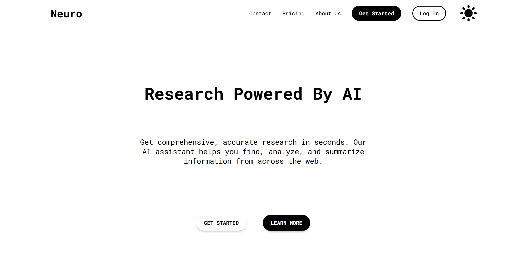
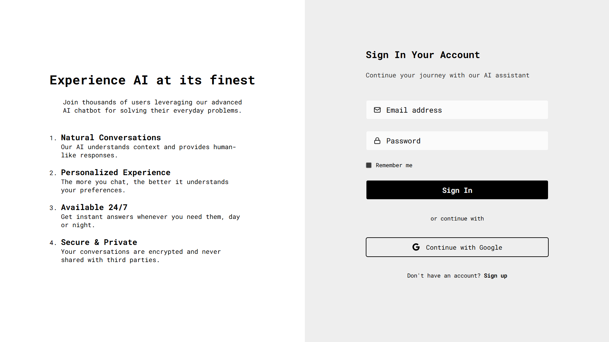
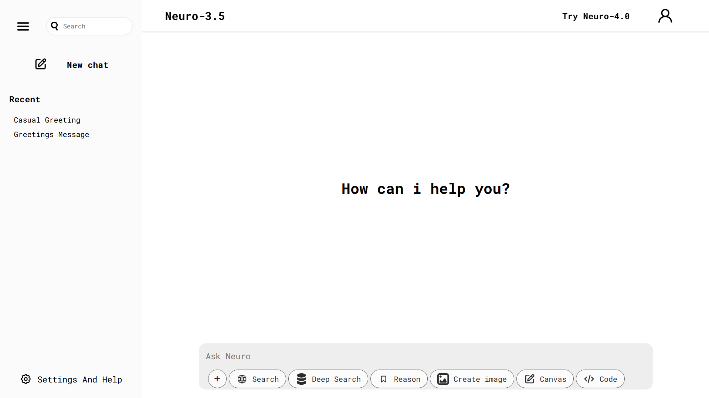

# 🧠 Neuro AI

**Neuro AI** is a visually engaging landing page for a fictional AI startup. Designed to be modern, responsive, and minimal, it showcases your frontend development and design skills using React and Next JS.

> 🔗 [Live Demo](https://neuro-ai-ten.vercel.app/)

---

## 🎯 Purpose

This project was built to demonstrate:

- A clean landing page layout
- Scroll-based UI sections
- Responsive design

---

## 🌟 Features

- 👁️ Stunning hero section with bold messaging
- 📄 Multiple content sections (About, Services, CTA)
- 📱 Fully responsive on all screen sizes
- 🎨 Smooth transitions and visual hierarchy
- ⚛️ Built using reusable React components

---

## 🔧 Tech Stack

- **Frontend**: React (Next)
- **Backend**: Node.js/Express
- **Database**: Mongodb
- **Styling**: Pure CSS
- **Hosting**: Vercel/Render

---

## 📸 Screenshots






---

## ⚙️ Getting Started

To run this project locally:

```bash
# Clone the repo
git clone https://github.com/AymenBraikia/neuro-ai.git

# Front end part

# Navigate into the client directory
cd chatbot

# Install dependencies
npm install

# Run the development server
npm run dev

# Back end part

# Navigate into the server directory
cd chatbot

# Install dependencies
npm install

# Run the development server
npm run dev
```
